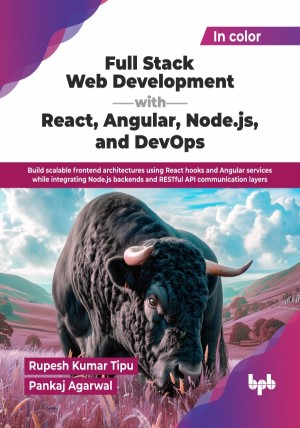

# Full Stack Web Development with React, Angular, Node.js, and DevOps

Build scalable frontend architectures using React hooks and Angular services while integrating Node.js backends and RESTful API communication layers.

This is the repository for [Full Stack Web Development with React, Angular, Node.js, and DevOps](https://bpbonline.com/products/full-stack-web-development-with-react-angular-node-js-and-devops-1?variant=45056646054088),published by BPB Publications.

## About the Book
Modern web development requires more than building pages and APIs. Developers now need to create responsive frontends, secure backends, reliable database integrations, and automated deployment workflows. This book addresses that need by bringing React, Angular, Node.js, and DevOps into one practical learning path. 

The book starts with HTML, CSS, advanced CSS, JavaScript, DOM, and core web technology fundamentals. It then moves into React and Angular, followed by hands-on frontend projects and framework comparison. On the backend side, it covers Node.js with Express.js, REST API development, authentication, MongoDB with Mongoose, PostgreSQL with Sequelize, web services, third-party APIs, Git and GitHub workflows, deployment strategies, and application security. The final part focuses on DevOps, including CI/CD, Docker, Docker Compose, Kubernetes, Jenkins, GitHub Actions, monitoring, and logging. 

By the end of this book, readers will be able to design, build, secure, deploy, and maintain complete web applications with confidence. The practical projects, exercises, and real-world workflow focus make it suitable for both academic learning and professional upskilling.

## What You Will Learn
• Build responsive interfaces with HTML, CSS, and JavaScript.

• Create React apps with hooks, routing, and testing.

• Develop Angular apps with forms, services, and guards.

• Build secure REST APIs using Node.js and Express.

• Integrate MongoDB and PostgreSQL in backend applications.

• Consume web services and deploy applications to the cloud.

• Automate delivery with Docker, Kubernetes, and CI/CD.
